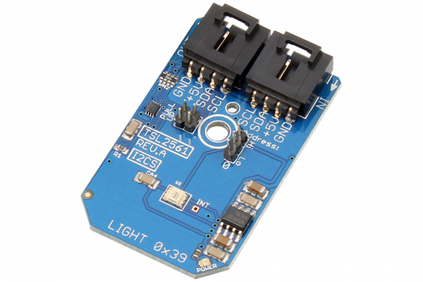

[](https://store.ncd.io/product/tsl2561-light-to-digital-converter-16-bit-programmable-gain-i2c-mini-module/).

#  TSL2561

Manufactured by AMS-TAOS USA Inc., the TSL2561 is a light-to-digital converter that transforms light intensity to a digital signal output with an integrated I2C interface.The TSL2561 is designed for display panels (LCD, OLED, etc.) with the purpose of extending battery life and providing optimum viewing in diverse lighting conditions.
This Device is available from www.ncd.io 

[SKU: TSL2561]

(https://store.ncd.io/product/tsl2561-light-to-digital-converter-16-bit-programmable-gain-i2c-mini-module/)
This Sample code can be used with Raspberry Pi.

Hardware needed to interface TSL2561 16Bit light to digital converter sensor With Raspberry Pi :
1. <a href="https://store.ncd.io/product/tsl2561-light-to-digital-converter-16-bit-programmable-gain-i2c-mini-module/">TSL2561 16Bit light to digital converter sensor</a>
2.  <a href="https://store.ncd.io/product/i2c-shield-for-raspberry-pi-3-pi2-with-outward-facing-i2c-port-terminates-over-hdmi-port/">Raspberry Pi I2C Shield</a>
3. <a href="https://store.ncd.io/product/i%C2%B2c-cable/">I2C Cable</a>

## Python
Download and install smbus library on Raspberry pi. Steps to install smbus are provided at:

https://pypi.python.org/pypi/smbus-cffi/0.5.1

Download (or git pull) the code in pi. Run the program.

```cpp
$> python TSL2561.py
```
The lib is a sample library, you will need to calibrate the sensor according to your application requirement.
